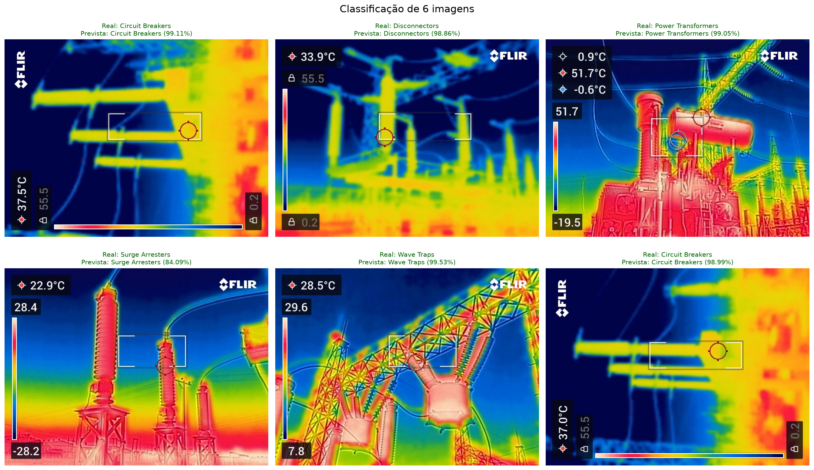

# Classificação de Equipamentos Elétricos por Imagens Térmicas

Pipeline de visão computacional para classificar cinco tipos de equipamentos elétricos a partir de imagens térmicas. O projeto combina embeddings visuais do DINOv2, descritores locais SIFT e um ensemble de classificadores tradicionais do scikit-learn.

## Classes

O dataset utilizado contém estas classes:

- Circuit Breakers
- Disconnectors
- Power Transformers
- Surge Arresters
- Wave Traps

## Visão geral do pipeline

1. Localiza o dataset e cria a estrutura de trabalho em `workspace/`.
2. Verifica a integridade das imagens e ignora arquivos corrompidos.
3. Normaliza as imagens para RGB e cria `workspace/cleaned/metadata.csv`.
4. Extrai características visuais:
   - DINOv2 `dinov2_vitb14`: embedding de 768 dimensões.
   - SIFT: descritor médio de 128 dimensões.
   - Vetor híbrido final: 896 dimensões.
5. Padroniza os atributos e remove atributos sem variação.
6. Seleciona os melhores atributos com `SelectKBest` e informação mútua.
7. Usa PCA para preservar a variância mais relevante.
8. Treina um `StackingClassifier` com KNN, Random Forest, SVM e regressão logística.
9. Executa validação cruzada estratificada com cinco divisões.
10. Salva o modelo final, métricas e gráficos em `workspace/models/` e `workspace/reports/`.

## Requisitos

- Windows 10 ou 11
- Python 3.12
- GPU NVIDIA recomendada para acelerar o DINOv2
- Driver NVIDIA instalado
- Dataset organizado em subpastas por classe

A CPU também pode executar o pipeline, mas a extração de embeddings será significativamente mais lenta.

## Instalação

Abra o PowerShell na raiz do projeto:

```powershell
Set-Location "D:\hd_central\projetos"
```

Crie ou use um ambiente virtual:

```powershell
python -m venv .venv
.\.venv\Scripts\python.exe -m pip install --upgrade pip
```

Instale o PyTorch com CUDA e as demais dependências:

```powershell
.\.venv\Scripts\python.exe -m pip install torch torchvision torchaudio --index-url https://download.pytorch.org/whl/cu128
.\.venv\Scripts\python.exe -m pip install numpy pandas pillow opencv-python matplotlib seaborn scikit-learn joblib
```

A versão CUDA do PyTorch deve ser compatível com a capacidade da GPU e com o driver instalado. O driver fornece a compatibilidade de execução; não é necessário instalar o CUDA Toolkit completo para executar esta aplicação com as wheels oficiais do PyTorch.

## Verificar o ambiente

```powershell
.\.venv\Scripts\python.exe -c "import torch; print(torch.__version__); print(torch.cuda.is_available()); print(torch.cuda.get_device_name(0) if torch.cuda.is_available() else 'CPU')"
```

Exemplo de saída esperada:

```text
2.11.0+cu128
True
NVIDIA GeForce GTX 1650
```

## Dataset

Por padrão, o caminho do dataset é configurado em `VIT.py`:

```python
dataset_dir: Path = Path(r"D:\hd_central\projetos\Infrared Power Equipment Dataset")
```

A estrutura esperada é:

```text
Infrared Power Equipment Dataset/
  Circuit Breakers/
  Disconnectors/
  Power Transformers/
  Surge Arresters/
  Wave Traps/
```

Cada pasta deve conter imagens `.jpg`, `.jpeg` ou `.png`. O programa verifica cada imagem antes de copiá-la para a área limpa.

## Executar o pipeline

Use `-u` para que os logs apareçam imediatamente no terminal:

```powershell
Set-Location "D:\hd_central\projetos"
.\.venv\Scripts\python.exe -u .\VIT.py
```

Para visualizar e salvar os logs ao mesmo tempo:

```powershell
.\.venv\Scripts\python.exe -u .\VIT.py 2>&1 | Tee-Object -FilePath .\pipeline.log
```

O primeiro carregamento do DINOv2 pode baixar o backbone e armazená-lo no cache local do Torch Hub. Nas próximas execuções, o cache será reutilizado.

## Avisos esperados

Mensagens como estas não indicam falha:

```text
Using cache found in ...torch\hub\facebookresearch_dinov2_main
UserWarning: xFormers is not available
```

O aviso sobre `xFormers` significa apenas que algumas otimizações de velocidade e memória não estão disponíveis. O DINOv2 continua funcional.

Se o Windows apresentar `WinError 1455` durante a validação cruzada, altere `n_jobs=-1` para `n_jobs=1` nas chamadas de `cross_validate` e `cross_val_predict` para limitar o uso de processos e memória virtual.

## Artefatos gerados

### `workspace/cleaned/`

- Imagens válidas convertidas para RGB.
- `metadata.csv` com caminho e classe de cada imagem.

### `workspace/features/`

- `X.npy`: matriz de características híbridas.
- `y.npy`: rótulos correspondentes.

### `workspace/models/`

- `class_names.joblib`: nomes das classes.
- `hybrid_stacking_model.joblib`: pipeline treinado.
- `pipeline_config.json`: configuração usada na inferência.
- `dinov2_best.pt`: checkpoint opcional de fine-tuning do DINOv2.

### `workspace/reports/`

- `classification_report.csv`: métricas por classe.
- `cv_results.csv`: resultados da validação cruzada.
- `feature_selection_results.csv`: comparação dos valores de `k`.
- `pca_results.csv`: comparação das variâncias do PCA.
- `confusion_matrix.png`: matriz de confusão.
- `explained_variance.png`: variância acumulada do PCA.
- `prediction_6_classes_novo_modelo.png`: painel com seis imagens classificadas.

## Resultado de referência

Em uma execução com 893 imagens válidas, o pipeline produziu:

- Acurácia média da validação cruzada: `99,10%`
- Acurácia global: `99,10%`

Esses valores dependem da versão das bibliotecas, do hardware, do estado do dataset e dos parâmetros usados.

### Exemplo de inferência

O painel abaixo mostra seis imagens do dataset, a classe real, a classe prevista e a probabilidade atribuída pelo modelo. Cinco classes estão representadas; a sexta imagem repete `Circuit Breakers` para facilitar a comparação visual.



## Inferência com o modelo salvo

Depois de executar o treinamento, a classe `Predictor` em `VIT.py` pode carregar o pipeline persistido e classificar uma nova imagem:

```python
from VIT import Predictor

predictor = Predictor("workspace/models")
classe, probabilidade = predictor.predict("caminho/para/imagem.jpg")
print(f"Classe: {classe}")
print(f"Probabilidade: {probabilidade:.2%}")
```

Também é possível usar o script de teste diretamente no terminal:

```powershell
.\.venv\Scripts\python.exe .\testar_predictor.py "caminho\para\imagem.jpg"
```

Se o caminho não for informado, o script solicitará a imagem interativamente:

```powershell
.\.venv\Scripts\python.exe .\testar_predictor.py
```

A imagem deve ser acessível pelo caminho informado e estar em um formato suportado pelo Pillow.

## Estrutura principal

```text
VIT.py                 Pipeline principal e classificação
vit_dinov2.py          Backbone DINOv2 e extração de embeddings
teste.py               Utilitário local de leitura de artefatos
workspace/             Cache, modelos e relatórios gerados
```


